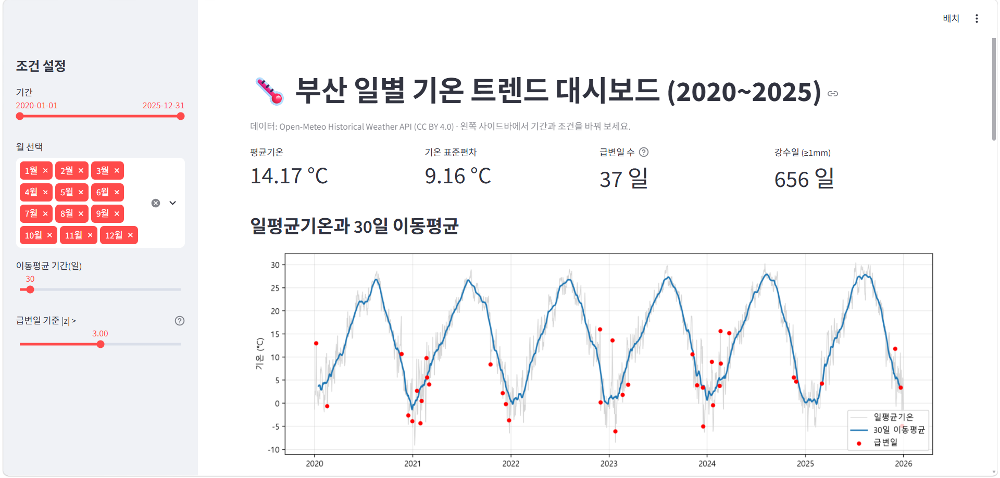
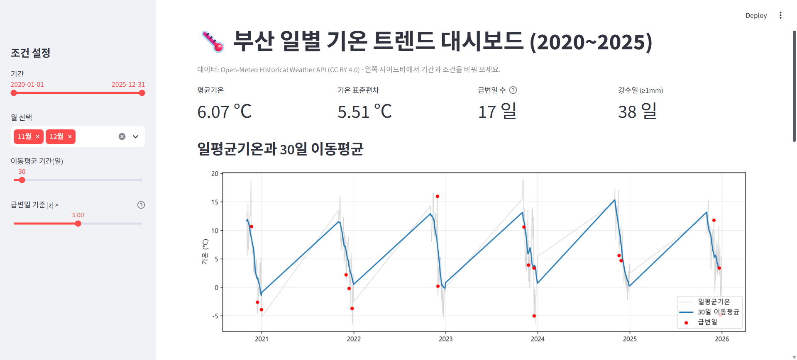
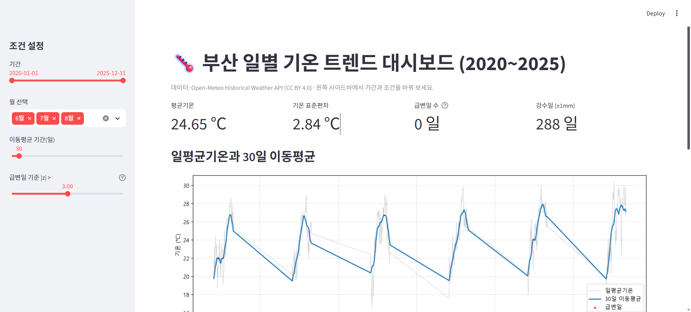
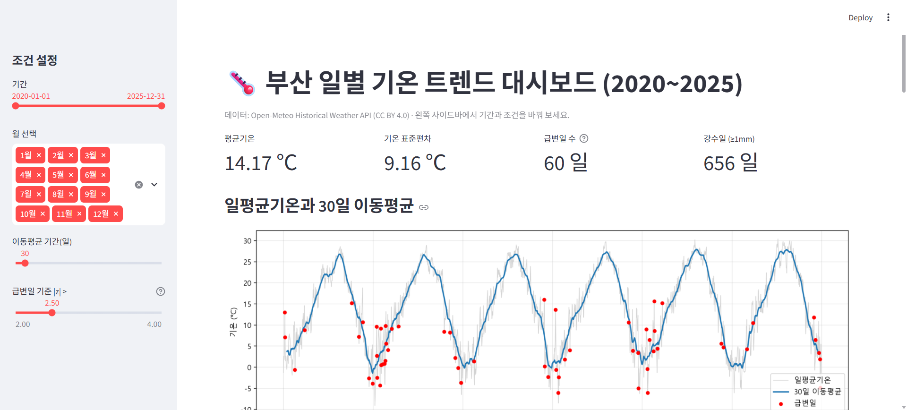

# busan-temperature-trend

부산 일별 기온(2020~2025) 시계열 트렌드 분석 프로젝트입니다. 분석 내용은 [REPORT.md](REPORT.md)에 있습니다.

## 폴더 구조

```
busan-temperature-trend/
├── data/
│   ├── busan_weather_raw.csv      # collect.py 원본 (파일명은 실제 이름 확인)
│   ├── busan_weather_clean.csv    # prepare.py 정제 결과
│   ├── prepare_log.txt            # 정제 점검 로그
│   └── analysis_log.txt           # 분석 수치 로그
├── images/                        # 그래프 (01~05), 대시보드 스크린샷
├── docs/busan_insights.xlsx       # 인사이트 정리표
├── collect.py                     # 1. 데이터 수집 (Open-Meteo API)
├── prepare.py                     # 2. 결측치·논리 오류·이상치 점검
├── analysis.py                    # 3. 이동평균·월별 집계·급변일 시각화
├── bonus.py                       # 보너스: 시계열 분해·베이스라인 예측
├── app.py                         # 보너스: Streamlit 대시보드
├── REPORT.md
└── requirements.txt
```

## 실행 방법 (Windows, Python 3.10 이상)

```bash
python -m venv venv
venv\Scripts\activate
pip install -r requirements.txt

python collect.py
python prepare.py
python analysis.py
python bonus.py
streamlit run app.py
```

## 대시보드 (보너스)

`streamlit run app.py`를 실행하면 브라우저에서 `http://localhost:8501`이 열립니다. 왼쪽 사이드바에서 **기간, 월, 이동평균 기간, 급변일 기준(|z|)**을 바꾸면 요약 지표, 기온 그래프, 연도별 평균, 월별 변동성, 급변일 목록이 함께 바뀝니다.

### 시나리오별 탐색 결과

| # | 시나리오 | 조작 | 결과 | 알 수 있는 점 |
|---|---|---|---|---|
| 1 | 전체 보기 | 기본값 (12개월, 기준 \|z\|>3.0) | 평균 14.17℃, 표준편차 9.16℃, 급변일 37일 | 리포트(`analysis_log.txt`) 수치와 일치 → 대시보드 계산 검증 |
| 2 | 초겨울 | 월 선택: 11, 12월 | 표준편차 5.51℃, **급변일 17일** | 전체 급변일의 46%가 두 달에 집중. 11~12월 평균은 2020년 5.38℃ → 2025년 6.50℃ |
| 3 | 여름 | 월 선택: 6, 7, 8월 | 표준편차 2.84℃, **급변일 0일** | 여름은 급변 없음. 여름 평균은 23.68℃ → 25.89℃로 **6년간 매년 상승** |
| 4 | 기준 완화 | 12개월, 기준 \|z\|>2.5 | **급변일 60일** (37일에서 증가) | 기준을 낮춰도 늘어난 급변일은 겨울·전환기에만 나타나고 여름에는 없음 → 결론이 기준에 민감하지 않음 |

#### 1. 전체 보기


#### 2. 초겨울 (11~12월)


#### 3. 여름 (6~8월)


#### 4. 급변일 기준 2.5


> 참고: 월을 일부만 선택하면 기온 그래프에서 선택하지 않은 기간이 직선으로 이어져 보입니다. 해당 구간은 데이터가 없는 것이 아니라 필터로 제외된 구간입니다.

## 데이터 출처 및 라이선스

- 출처: [Open-Meteo Historical Weather API](https://open-meteo.com/), 부산 좌표 기준 일별 데이터
- 라이선스: CC BY 4.0 — Weather data by Open-Meteo.com
- 재분석(reanalysis) 기반 격자 데이터로, 기상청 관측소 실측값과 다를 수 있습니다.
