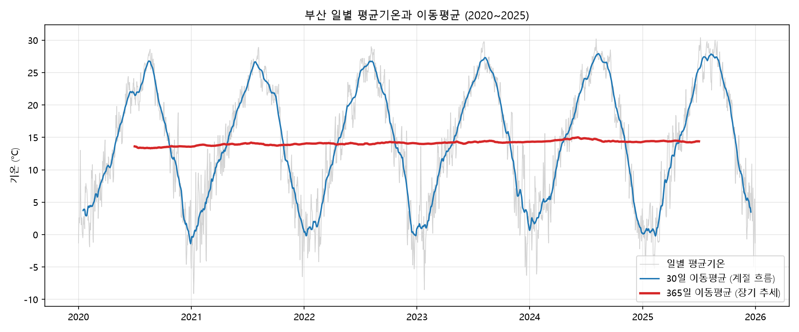
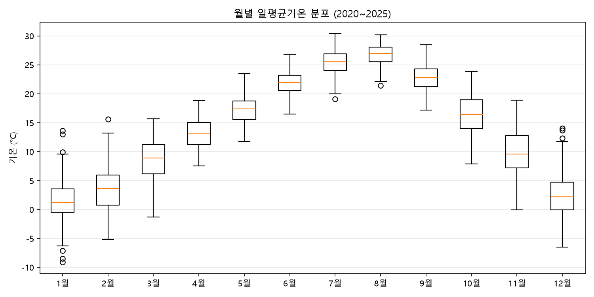
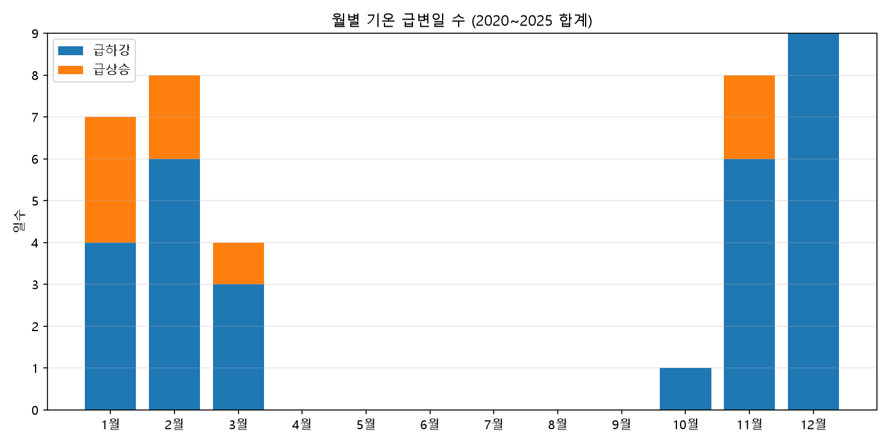

# 부산 2020~2025년 일별 기온 트렌드 분석 리포트

> ✍️ 표시된 부분은 직접 작성할 칸입니다. 작성 후 이 안내 줄과 ✍️ 표시는 지워 주세요.

## 1. 분석 주제 및 선정 이유

- 주제: 부산의 일별 기온 데이터로 장기 추세, 계절성, 기온 급변 패턴을 확인한다.
- 선정 이유: ✍️ (예: 내가 사는 도시의 날씨가 실제로 변하고 있는지 데이터로 확인해 보고 싶었다 등)

## 2. 분석 질문

1. 2020~2025년 사이 부산의 연평균기온은 상승하는 경향이 있는가?
2. 계절(월)별로 기온의 변동성은 다른가? 어느 시기가 가장 불안정한가?
3. 하루 사이 기온이 급변한 날은 언제 몰려 있고, 강수와 관련이 있는가?

## 3. 데이터 설명

| 항목 | 내용 |
|---|---|
| 출처 | [Open-Meteo Historical Weather API](https://open-meteo.com/) |
| 기간 | 2020-01-01 ~ 2025-12-31 |
| 데이터 수 | 2,192일 (일별 1행) |
| 주요 컬럼 | `temp_mean`, `temp_max`, `temp_min` (℃), `precipitation` (mm) |
| 파생 컬럼 | `is_filled`(보간 여부), `temp_change`(전일 대비 변화량), `is_outlier`(급변일 표시) |
| 라이선스 | CC BY 4.0 — Weather data by Open-Meteo.com |

- 주의: Open-Meteo 과거 데이터는 기상청 관측소 실측값이 아니라 재분석(reanalysis) 기반 격자 데이터로, 기상청 부산관측소 기록과 수치가 다를 수 있다.

## 4. 데이터 정제

`prepare.py`에서 다음을 점검했다. 상세 결과는 `data/prepare_log.txt` 참고.

| 점검 항목 | 기준 | 결과 | 처리 |
|---|---|---|---|
| 숨은 결측치 | 기간 내 빠진 날짜, 중복 날짜 | 0건 (2,192행 = 기간 전체 일수) | 없음 |
| 컬럼 결측치 | 기온·강수 컬럼의 빈 값 | 0개 | 보간 대비 코드만 두고 실제 보간 0일 (`is_filled` 전부 False) |
| 물리적 범위 | 기온 -20~45℃ 밖의 값 | 0개 | 없음 |
| 논리 오류 | 최저 ≤ 평균 ≤ 최고 위반 | 0건 | 없음 |
| 이상치(급변일) | 전일 대비 변화량의 \|z\| > 3 | 37일 | 삭제하지 않고 `is_outlier`로 표시 |

- **결측치가 0개여도 점검한 이유**: 날짜 행 자체가 빠지면 `isna()`로는 잡히지 않기 때문에, 날짜 연속성과 논리 관계까지 따로 확인했다.
- **이상치 기준**: 일교차가 아니라 '전날 대비 평균기온 변화'를 기준으로 했다. 변화량의 평균은 0.00℃, 표준편차는 2.06℃이므로, |z| > 3은 하루 사이 약 **±6.2℃ 넘게** 변한 날을 뜻한다. 정규분포에서 |z| > 3은 약 0.3%에 해당하는 드문 값이라 흔히 쓰는 기준이다.
- **표시만 하고 삭제하지 않은 이유**: 기온 급변은 측정 오류일 수도 있지만 한파 등 실제 기상 현상일 가능성이 크고, 삭제하면 실제 변동성을 과소평가하게 되기 때문이다.

## 5. 분석 기법

| 기법 | 적용 방법 | 적용 이유 |
|---|---|---|
| 이동평균 | 30일·365일 중심 이동평균 | 30일은 계절 흐름, 365일은 계절성을 제거한 장기 추세를 보기 위해 |
| 월별 집계 | 월별 평균·표준편차 | 계절성과 시기별 변동성 비교 |
| 변화량 | 전일 대비 기온 차이(`temp_change`) | 급변일 탐지 |

- 365일 중심 이동평균은 앞뒤 반년치 데이터가 필요하므로 2020년 상반기와 2025년 하반기에는 값이 없다.
- 일 단위 대신 연도·월 단위로 집계한 이유: 일별 기온은 노이즈가 커서 추세와 계절 차이가 가려지기 때문이다.

## 6. 시각화

### 그래프 1. 일별 평균기온과 이동평균



회색 선(일별 값)은 노이즈, 파란 선(30일 이동평균)은 계절성, 빨간 선(365일 이동평균)은 추세를 보여준다. 단, y축 범위가 약 40℃로 넓어 1℃ 수준의 연간 차이는 그래프에서 평평하게 보이므로 연도별 수치로 함께 확인했다.

### 그래프 2. 월별 일평균기온 분포



상자 높이가 해당 월의 기온 변동 폭을 나타낸다.

### 그래프 3. 월별 기온 급변일 수



파란색은 급하강, 주황색은 급상승 일수다.

## 7. 인사이트

### 인사이트 1. 6년간 연평균기온은 오르내림을 반복하며 상승하는 경향을 보였다

- **관찰(Fact)**: 연평균기온은 2020년 13.56℃(최저)에서 2024년 14.81℃(최고)로 1.25℃ 차이가 난다. 다만 2022년(전년 대비 -0.13℃)과 2025년(-0.42℃)에는 하락해, 매년 꾸준히 오른 것은 아니다.
- **해석(가설)**: ✍️
- **행동(Action)**: ✍️ (예: 더 긴 기간 데이터로 같은 분석을 해 보기 등)

### 인사이트 2. 겨울철 기온 변동성은 여름의 약 2배다

- **관찰(Fact)**: 월별 표준편차는 여름(6~8월) 평균 2.00℃, 11~12월 평균 3.97℃로 약 2.0배 차이가 난다. 가장 안정적인 달은 8월(1.85℃), 가장 불안정한 달은 11월(4.00℃)이다.
- **해석(가설)**: ✍️
- **행동(Action)**: ✍️

### 인사이트 3. 기온 급변은 추운 계절에만, 주로 하강 방향으로 일어난다

- **관찰(Fact)**: 급변일 37일이 모두 10~3월에 있고 4~9월에는 0일이다. 급하강이 29일로 급상승(8일)의 약 3.6배다. 강수 10mm 이상인 날의 비율은 급상승일 50%(4/8일), 급하강일 3%(1/29일)로 크게 다르다.
- **해석(가설)**: ✍️
- **행동(Action)**: ✍️ (예: 급변일 날짜를 기상청 자료나 뉴스와 대조해 실제 한파였는지 확인 등)

## 8. 결론 및 한계점

### 결론

✍️ (인사이트 3개를 2~3문장으로 요약)

### 한계점

- **짧은 분석 기간**: 6년은 기후 추세를 판단하기에 짧아, 한두 해의 이례적인 기온이 결과를 크게 흔들 수 있다. 인사이트 1의 상승 경향을 장기 온난화로 일반화하기 어렵다.
- **데이터 특성**: 재분석 격자 데이터라 특정 관측소 실측값과 다를 수 있다.
- **외부 변수 미반영**: 기압 배치, 바람 방향 등 기온 변화의 원인이 되는 변수는 데이터에 없어, 해석은 가설 수준에 머문다.
- **급변일 기준의 임의성**: |z| > 3은 관례적인 기준일 뿐이며, 기준을 2.5나 3.5로 바꾸면 일수와 월별 분포가 달라질 수 있다. 또한 기온 변화량은 계절마다 분포가 달라 1년 전체로 계산한 z값은 겨울 급변을 더 많이 잡을 수 있다.

## 9. AI 사용 로그

| 사용 작업 | 사용 이유 | 검증 방법 |
|---|---|---|
| 데이터 수집·전처리 코드 작성 (`collect.py`, `prepare.py`) | 시간 절감, 점검 항목(숨은 결측치·논리 오류·급변일) 아이디어 탐색 | 직접 실행해 결과 행 수(2,192)와 날짜 범위 확인, 출력된 급변일 샘플 확인 |
| 시각화 코드 작성 (`analysis.py`) | 시간 절감 | 실행 중 `boxplot()` 인자 오류 발생 → 설치된 matplotlib 버전과 맞지 않는 코드였음을 확인하고 수정 후 재실행으로 검증 |
| 그래프 해석 보조 | 관찰과 해석 구분 연습 | AI가 제시한 내용 중 그래프 y축 스케일 문제를 연도별 수치로 교차 확인. 해석(가설)은 직접 작성 |
| 인사이트 정리 스프레드시트 (`docs/busan_insights.xlsx`) | 수치 정리 | 스프레드시트 수치를 `data/analysis_log.txt`와 대조 |

✍️ 위 내용을 실제 경험에 맞게 고치고, 추가로 AI를 쓴 작업이 있으면 적어 주세요.

## 10. 실행 방법

```bash
python -m venv venv
venv\Scripts\activate
pip install -r requirements.txt

python collect.py    # 데이터 수집 → data/
python prepare.py    # 정제 → data/busan_weather_clean.csv
python analysis.py   # 분석 → images/, 콘솔 수치 출력
```

- 개발 환경: Python 3.10 이상
