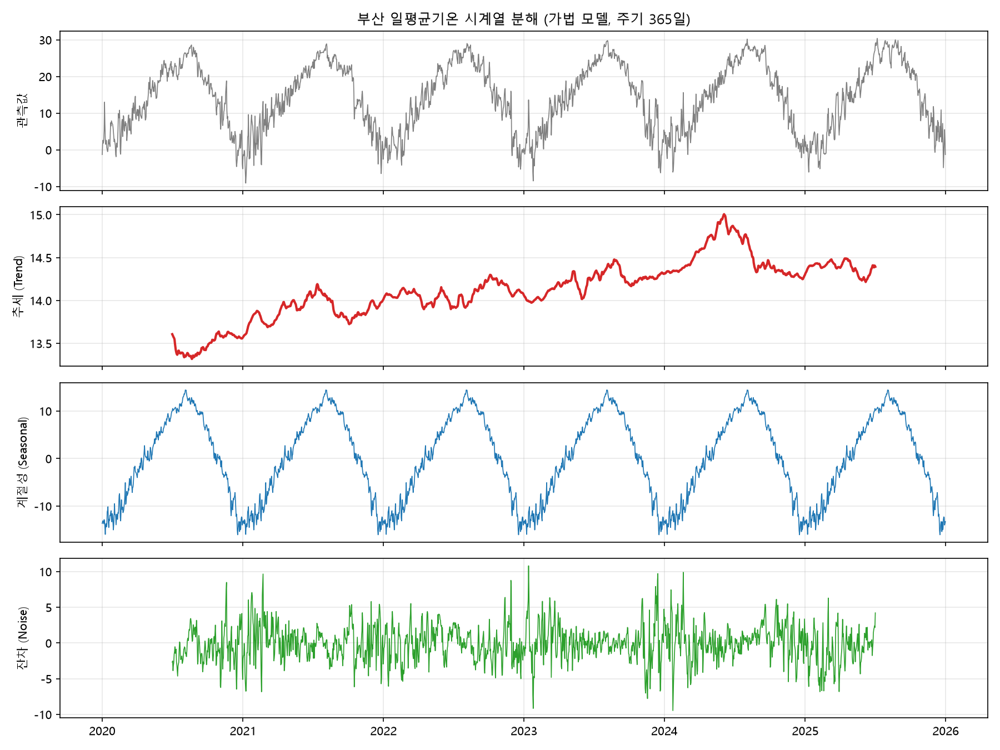
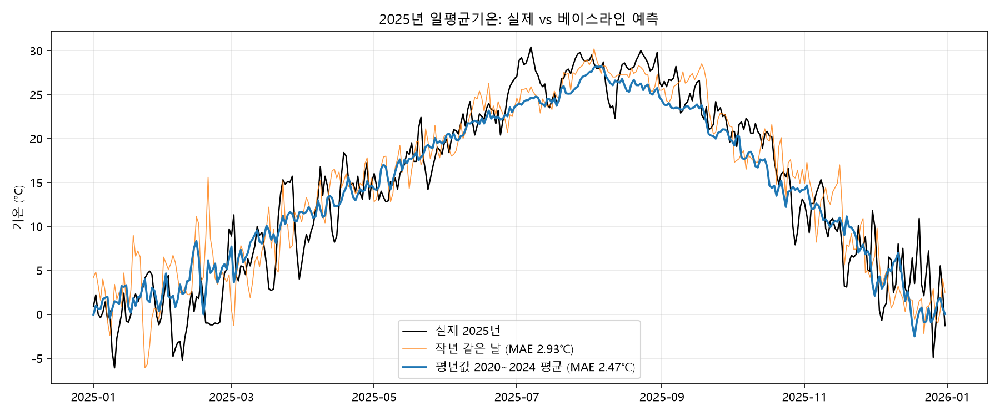

# 부산 2020~2025년 일별 기온 트렌드 분석 리포트

> ✍️ 표시는 본인 확인이 필요한 칸, ⏳ 표시는 `python bonus.py` 실행 결과로 채울 칸입니다. 완성 후 이 안내 줄은 지워 주세요.

## 1. 분석 주제 및 선정 이유

- 주제: 부산의 일별 기온 데이터로 장기 추세, 계절성, 기온 급변 패턴을 확인한다.
- 선정 이유: 기온은 매일 체감하는 데이터라 분석 결과를 경험과 대조해 검증하기 쉽고, "요즘 겨울 날씨가 들쭉날쭉하다", "해마다 더워진다"는 체감이 데이터로도 확인되는지 알고 싶었다. ✍️ (본인 이유로 다듬기)

## 2. 분석 질문

1. 2020~2025년 사이 부산의 연평균기온은 상승하는 경향이 있는가?
2. 계절(월)별로 기온의 변동성은 다른가? 어느 시기가 가장 불안정한가?
3. 하루 사이 기온이 급변한 날은 언제 몰려 있고, 강수와 관련이 있는가?

## 3. 데이터 설명

| 항목 | 내용 |
|---|---|
| 출처 | [Open-Meteo Historical Weather API](https://open-meteo.com/) |
| 기간 | 2020-01-01 ~ 2025-12-31 |
| 데이터 수 | 2,192일 (일별 1행) |
| 주요 컬럼 | `temp_mean`, `temp_max`, `temp_min` (℃), `precipitation` (mm) |
| 파생 컬럼 | `is_filled`(보간 여부), `temp_change`(전일 대비 변화량), `is_outlier`(급변일 표시) |
| 라이선스 | CC BY 4.0 — Weather data by Open-Meteo.com |

- 주의: Open-Meteo 과거 데이터는 기상청 관측소 실측값이 아니라 재분석(reanalysis) 기반 격자 데이터로, 기상청 부산관측소 기록과 수치가 다를 수 있다.

## 4. 데이터 정제

`prepare.py`에서 다음을 점검했다. 상세 결과는 `data/prepare_log.txt` 참고.

| 점검 항목 | 기준 | 결과 | 처리 |
|---|---|---|---|
| 숨은 결측치 | 기간 내 빠진 날짜, 중복 날짜 | 0건 (2,192행 = 기간 전체 일수) | 없음 |
| 컬럼 결측치 | 기온·강수 컬럼의 빈 값 | 0개 | 보간 대비 코드만 두고 실제 보간 0일 (`is_filled` 전부 False) |
| 물리적 범위 | 기온 -20~45℃ 밖의 값 | 0개 | 없음 |
| 논리 오류 | 최저 ≤ 평균 ≤ 최고 위반 | 0건 | 없음 |
| 이상치(급변일) | 전일 대비 변화량의 \|z\| > 3 | 37일 | 삭제하지 않고 `is_outlier`로 표시 |

- **결측치가 0개여도 점검한 이유**: 날짜 행 자체가 빠지면 `isna()`로는 잡히지 않기 때문에, 날짜 연속성과 논리 관계까지 따로 확인했다.
- **이상치 기준**: 일교차가 아니라 '전날 대비 평균기온 변화'를 기준으로 했다. 변화량의 평균은 0.00℃, 표준편차는 2.06℃이므로, |z| > 3은 하루 사이 약 **±6.2℃ 넘게** 변한 날을 뜻한다. 정규분포에서 |z| > 3은 약 0.3%에 해당하는 드문 값이라 흔히 쓰는 기준이다.
- **표시만 하고 삭제하지 않은 이유**: 기온 급변은 측정 오류일 수도 있지만 한파 등 실제 기상 현상일 가능성이 크고, 삭제하면 실제 변동성을 과소평가하게 되기 때문이다.

## 5. 분석 기법

| 기법 | 적용 방법 | 적용 이유 |
|---|---|---|
| 이동평균 | 30일·365일 중심 이동평균 | 30일은 계절 흐름, 365일은 계절성을 제거한 장기 추세를 보기 위해 |
| 월별 집계 | 월별 평균·표준편차 | 계절성과 시기별 변동성 비교 |
| 변화량 | 전일 대비 기온 차이(`temp_change`) | 급변일 탐지 |

- 365일 중심 이동평균은 앞뒤 반년치 데이터가 필요하므로 2020년 상반기와 2025년 하반기에는 값이 없다.
- 일 단위 대신 연도·월 단위로 집계한 이유: 일별 기온은 노이즈가 커서 추세와 계절 차이가 가려지기 때문이다.

## 6. 시각화

### 그래프 1. 일별 평균기온과 이동평균


회색 선(일별 값)은 노이즈, 파란 선(30일 이동평균)은 계절성, 빨간 선(365일 이동평균)은 추세를 보여준다. 단, y축 범위가 약 40℃로 넓어 1℃ 수준의 연간 차이는 그래프에서 평평하게 보이므로 연도별 수치로 함께 확인했다.

### 그래프 2. 월별 일평균기온 분포


상자 높이가 해당 월의 기온 변동 폭을 나타낸다.

### 그래프 3. 월별 기온 급변일 수


파란색은 급하강, 주황색은 급상승 일수다. 12월의 9일은 모두 급하강이며, 급상승은 1~3월과 11월에만 나타난다.

## 7. 인사이트

### 인사이트 1. 6년간 연평균기온은 오르내림을 반복하며 상승하는 경향을 보였다

- **관찰(Fact)**: 연평균기온은 2020년 13.56℃(최저)에서 2024년 14.81℃(최고)로 1.25℃ 차이가 난다. 다만 2022년(전년 대비 -0.13℃)과 2025년(-0.42℃)에는 하락해, 매년 꾸준히 오른 것은 아니다.
- **해석(가설)**: 부산만의 현상이라기보다 동아시아·전 지구 기온이 함께 높았던 해의 영향일 수 있다. 2024년은 국내외에서 기록적으로 더운 해로 보도되었고, 이는 장기 온난화 위에 해마다의 자연 변동(엘니뇨 등)이 더해진 결과일 수 있다. 반대로 2022년·2025년의 하락은 상승이 직선적이지 않고 해마다의 변동이 크다는 반례다.
- **검증 필요**: 기상청 연 기후 보고서의 전국 연평균기온 순위와 부산 결과가 같은 방향인지 대조한다.
- **행동(Action)**: 30년 이상 데이터로 같은 분석을 반복해, 6년 구간의 상승이 장기 추세의 일부인지 확인한다. 보너스 분석(시계열 분해)에서 계절성을 제거한 추세선도 함께 확인했다(10장).

### 인사이트 2. 겨울철 기온 변동성은 여름의 약 2배다

- **관찰(Fact)**: 월별 표준편차는 여름(6~8월) 평균 2.00℃, 11~12월 평균 3.97℃로 약 2.0배 차이가 난다. 가장 안정적인 달은 8월(1.85℃), 가장 불안정한 달은 11월(4.00℃)이다.
- **해석(가설)**: 겨울에는 시베리아 고기압이 강해졌다 약해졌다를 반복하며 찬 공기가 주기적으로 내려와(이른바 삼한사온), 며칠 단위로 기온이 크게 오르내릴 수 있다. 반면 여름에는 북태평양 고기압이 오래 머물며 덥고 습한 공기가 안정적으로 유지되어 변동이 작을 수 있다.
- **검증 필요**: 겨울철 기온과 기압(또는 풍향) 데이터를 함께 보아, 급하강 직전·직후에 북서풍이 강해지는지 확인한다.
- **행동(Action)**: 겨울철(11~2월)에는 하루 단위 기온 예보 변화를 더 주의할 필요가 있다. 분석 측면에서는 계절별로 이상치 기준을 따로 잡는 방식과 결과를 비교해 본다(한계점 참고).

### 인사이트 3. 기온 급변은 추운 계절에만, 주로 하강 방향으로 일어난다

- **관찰(Fact)**: 급변일 37일이 모두 10~3월에 있고 4~9월에는 0일이다. 급하강이 29일로 급상승(8일)의 약 3.6배다. 강수 10mm 이상인 날의 비율은 급상승일 50%(4/8일), 급하강일 3%(1/29일)로 크게 다르다.
- **해석(가설)**: 겨울철 저기압이 지나갈 때 앞쪽에서는 남서쪽의 따뜻하고 습한 공기가 들어와 비가 오며 기온이 오르고, 저기압이 빠져나간 뒤에는 북서쪽의 차고 건조한 공기가 내려와 맑으면서 기온이 급격히 떨어지는 패턴일 수 있다. 실제로 2024-02-19(강수 43.6mm, +6.9℃) 바로 다음 날 2024-02-20(-7.0℃)처럼 "비와 함께 급상승 → 다음 날 급하강"이 이어진 쌍이 관찰된다. 급하강이 급상승보다 3.6배 많은 것은 찬 공기의 남하가 따뜻한 공기의 유입보다 짧은 시간에 강하게 일어나기 때문일 수 있다.
- **반례·주의**: 4장에서 설명했듯 이상치 기준(z-score)을 1년 전체 분포로 계산했으므로, 원래 변동이 큰 겨울이 더 많이 잡히는 구조적 영향도 있다. 따라서 "여름에는 급변이 전혀 없다"보다는 "겨울 급변이 상대적으로 훨씬 크고 잦다"로 해석하는 것이 안전하다.
- **행동(Action)**: Open-Meteo에서 일별 주풍향(`wind_direction_10m_dominant`)을 추가로 수집해, 급상승일에는 남풍 계열, 급하강일에는 북풍 계열이 우세한지 확인한다. 급변일 날짜를 기상청 한파특보·뉴스와 대조해 실제 기상 사건이었는지도 확인한다.

## 8. 결론 및 한계점

### 결론

2020~2025년 부산의 일평균기온은 계절성이 지배적이며(월평균 1.50℃ ~ 26.66℃), 계절성을 걷어내면 연평균은 오르내림을 반복하면서도 2024년에 최고를 기록하는 상승 경향을 보였다. 다만 6년이라는 짧은 기간이라 장기 온난화로 단정할 수는 없다. 기온의 불안정성은 계절에 따라 뚜렷하게 달라, 겨울(특히 11~12월)은 여름보다 변동성이 약 2배 크고 하루 ±6℃가 넘는 급변이 모두 추운 계절에 집중되었다. 급변은 주로 하강 방향이며, 비를 동반한 급상승 직후 맑은 날 급하강이 이어지는 패턴이 보여, 겨울철 저기압 통과와 찬 공기 남하가 원인일 가능성이 있다. 이는 추가 변수(풍향·기압) 분석으로 검증할 과제로 남긴다.

### 한계점

- **짧은 분석 기간**: 6년은 기후 추세를 판단하기에 짧아, 한두 해의 이례적인 기온이 결과를 크게 흔들 수 있다. 인사이트 1의 상승 경향을 장기 온난화로 일반화하기 어렵다.
- **데이터 특성**: 재분석 격자 데이터라 특정 관측소 실측값과 다를 수 있다.
- **외부 변수 미반영**: 기압 배치, 바람 방향 등 기온 변화의 원인이 되는 변수는 데이터에 없어, 해석은 가설 수준에 머문다.
- **급변일 기준의 임의성**: |z| > 3은 관례적인 기준일 뿐이며, 기준을 2.5나 3.5로 바꾸면 일수와 월별 분포가 달라질 수 있다. 또한 기온 변화량은 계절마다 분포가 달라 1년 전체로 계산한 z값은 겨울 급변을 더 많이 잡을 수 있다.

## 9. AI 사용 로그

| 사용 작업 | 사용 이유 | 검증 방법 |
|---|---|---|
| 데이터 수집·전처리 코드 작성 (`collect.py`, `prepare.py`) | 시간 절감, 점검 항목(숨은 결측치·논리 오류·급변일) 아이디어 탐색 | 직접 실행해 결과 행 수(2,192)와 날짜 범위 확인, 출력된 급변일 샘플 확인 |
| 시각화 코드 작성 (`analysis.py`) | 시간 절감 | 실행 중 `boxplot()` 인자 오류 발생 → 설치된 matplotlib 버전과 맞지 않는 코드였음을 확인하고 수정 후 재실행으로 검증 |
| 그래프 해석 보조 | 관찰과 해석 구분 연습 | AI가 제시한 내용 중 그래프 y축 스케일 문제를 연도별 수치로 교차 확인. 해석(가설)은 직접 작성 |
| 인사이트 정리 스프레드시트 (`docs/busan_insights.xlsx`) | 수치 정리 | 스프레드시트 수치를 `data/analysis_log.txt`와 대조 |
| 인사이트 해석(가설)·결론 문장 초안 | 대안 탐색, 문장 다듬기 | AI가 제시한 후보 가설 중 데이터와 맞지 않는 것(측정 장비 오류 → 재분석 데이터라 해당 없음, 여름 비 → 여름 급변일 0일)을 직접 배제. 남은 가설은 관찰 수치(2024-02-19→20 쌍 등)와 대조했고, 외부 자료(기상청 보고서) 확인은 행동 항목으로 남김 |
| 보너스 코드 (`bonus.py`, `app.py`) | 시간 절감 | 실행 결과와 대시보드 수치를 `analysis_log.txt`의 기존 수치(급변일 37일 등)와 대조. `use_container_width` 등 지원 종료 예정 인자를 미리 제거 |

✍️ 실제 경험과 다른 부분이 있으면 고쳐 주세요. 특히 해석은 AI 초안을 그대로 두지 말고, 본인이 동의하는지 확인한 뒤 본인 말로 다듬는 것을 권장합니다.

## 10. 보너스: 시계열 분해와 베이스라인 예측

`bonus.py`로 수행했다.

### (A) 시계열 분해



일평균기온을 **추세 + 계절성 + 잔차(노이즈)**로 나누었다(가법 모델, 주기 365일).

- **관찰(Fact)**: 추세는 ⏳℃(2020년 중반)에서 ⏳℃(2025년 중반)로 ⏳℃ 변했다. 계절성 진폭은 약 ⏳℃로, 연 추세 변화보다 훨씬 크다. 잔차 표준편차는 ⏳℃이며 월별로는 ⏳월이 가장 크다.
- **해석(가설)**: 계절성이 기온 변동의 대부분을 설명하므로, 원본 그래프에서 추세가 평평하게 보인 것은 자연스럽다(그래프 1 설명과 같은 맥락). 분해로 계절성을 걷어내야 1℃ 수준의 추세가 보인다.
- **한계**: 가법 분해는 매년 계절 패턴이 같다고 가정하며, 365일 주기라 시작·끝 반년은 추세값이 없다.

### (B) 베이스라인 예측



2020~2024년 데이터만으로 2025년 365일을 예측하고 평균절대오차(MAE)로 비교했다.

| 방법 | 가정 | MAE |
|---|---|---|
| 작년 같은 날 | 올해 날씨는 작년 같은 날과 같다 | ⏳℃ |
| 평년값 (2020~2024 같은 월·일 평균) | 올해 날씨는 지난 5년 평균과 같다 | ⏳℃ |

- **관찰(Fact)**: ⏳ 방식의 오차가 더 작았다. 2025년 실제 평균은 평년값보다 ⏳℃ 높았다.
- **해석(가설)**: 하루하루의 날씨는 우연성(노이즈)이 커서 작년 한 해의 값을 그대로 쓰면 그 해의 우연한 변동까지 복사된다. 여러 해를 평균하면 노이즈가 상쇄되어 계절성만 남으므로 더 안정적인 기준이 된다.
- **한계**: 두 방법 모두 추세와 당일 기상 상황을 반영하지 못해, 온난화 추세가 계속되면 평년값은 체계적으로 낮게 예측할 수 있다. 정확한 예측이 목적이 아니라 "아무 정보 없이 맞힐 수 있는 수준"의 기준선이다.

## 11. 보너스: 대시보드

`app.py`(Streamlit)로 기간·월·이동평균 기간·급변일 기준을 바꿔 가며 탐색할 수 있다. 실행 방법과 시나리오별 스크린샷은 [README.md](README.md) 참고.

## 12. 실행 방법

```bash
python -m venv venv
venv\Scripts\activate
pip install -r requirements.txt

python collect.py    # 데이터 수집 → data/
python prepare.py    # 정제 → data/busan_weather_clean.csv
python analysis.py   # 분석 → images/01~03, 콘솔 수치 출력
python bonus.py      # 보너스 분해·예측 → images/04~05
streamlit run app.py # 보너스 대시보드 → http://localhost:8501
```

- 개발 환경: Python 3.10 이상
